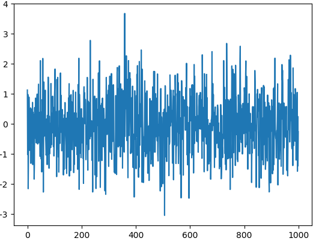
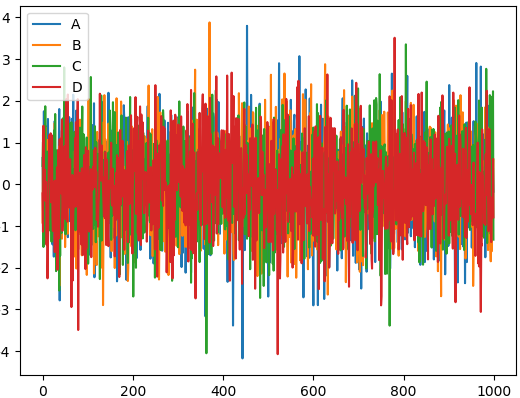
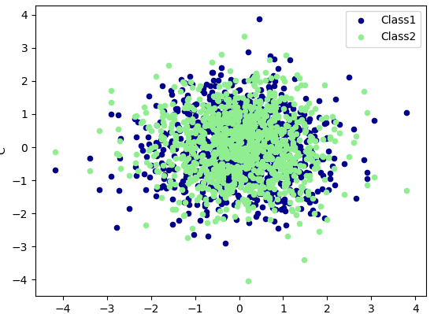

在上一篇中我们介绍了如何创建并访问pandas的Series和DataFrame型的数据，本篇将介绍如何对pandas数据进行操作，掌握这些操作之后，基本可以处理大多数的数据了。首先，导入本篇中使用到的模块：

``` python
import numpy as np
import pandas as pd
from pandas import Series, DataFrame
```
为了看数据方便一些，我们设置一下输出屏幕的宽度
``` python
pd.set_option('display.width', 200)
```

## 数据创建的其他方式
数据结构的创建不止是上篇中介绍的标准形式，本篇再介绍几种。例如，我们可以创建一个以日期为元素的Series：

``` python
In [3]: dates = pd.date_range('20150101', periods=5)

In [4]: dates
Out[4]: DatetimeIndex(['2015-01-01', '2015-01-02', '2015-01-03', '2015-01-04', '2015-01-05'], dtype='datetime64[ns]', freq='D')
```

将这个日期Series作为索引赋给一个DataFrame：

``` python
In [6]: df = pd.DataFrame(np.random.randn(5, 4),index=dates,columns=list('ABCD'))

In [7]: df
Out[7]:
                   A         B         C         D
2015-01-01 -1.920304  1.384082 -1.371671 -0.148773
2015-01-02  0.250032 -0.086736  1.213414 -0.882525
2015-01-03 -0.711571 -0.518825  0.517639  0.671488
2015-01-04 -0.065331 -1.303340 -0.234200  1.110965
2015-01-05 -1.258520 -0.547136 -0.292265 -0.842314
```

只要是能转换成Series的对象，都可以用于创建DataFrame：

``` python
In [8]: df2 = pd.DataFrame({ 'A' : 1., 'B': pd.Timestamp('20150214'), 'C': pd.Series(1.6,index=list(range(4)),dtype='float64'), 'D' : np.array([4] * 4, dtype='int64'), 'E' : 'hello pandas!' })

In [9]: df2
Out[9]:
     A          B    C  D              E
0  1.0 2015-02-14  1.6  4  hello pandas!
1  1.0 2015-02-14  1.6  4  hello pandas!
2  1.0 2015-02-14  1.6  4  hello pandas!
3  1.0 2015-02-14  1.6  4  hello pandas!
```

## Pandas 处理丢失数据
有时候我们导入或处理数据, 会产生一些空的或者是 NaN 数据,如何删除或者是填补这些 NaN 数据就是我们今天所要提到的内容.

建立了一个6X4的矩阵数据并且把两个位置置为空.

``` python
In [13]: dates = pd.date_range('20130101', periods=6)
    ...: df = pd.DataFrame(np.arange(24).reshape((6,4)),index=dates, columns=['A','B','C','D'])
    ...: df.iloc[0,1] = np.nan
    ...: df.iloc[1,2] = np.nan
    ...:

In [14]: df
Out[14]:
             A     B     C   D
2013-01-01   0   NaN   2.0   3
2013-01-02   4   5.0   NaN   7
2013-01-03   8   9.0  10.0  11
2013-01-04  12  13.0  14.0  15
2013-01-05  16  17.0  18.0  19
2013-01-06  20  21.0  22.0  23
```

pd.dropna()

如果想直接去掉有 NaN 的行或列, 可以使用 dropna

``` python
In [15]: df.dropna(
    ...:     axis=0,     # 0: 对行进行操作; 1: 对列进行操作
    ...:     how='any'   # 'any': 只要存在 NaN 就 drop 掉; 'all': 必须全部是 NaN 才 drop
    ...:     )
    ...:
Out[15]:
             A     B     C   D
2013-01-03   8   9.0  10.0  11
2013-01-04  12  13.0  14.0  15
2013-01-05  16  17.0  18.0  19
2013-01-06  20  21.0  22.0  2
```

pd.fillna()

如果是将 NaN 的值用其他值代替, 比如代替成 0:

``` python
In [16]: df.fillna(value=0)
Out[16]:
             A     B     C   D
2013-01-01   0   0.0   2.0   3
2013-01-02   4   5.0   0.0   7
2013-01-03   8   9.0  10.0  11
2013-01-04  12  13.0  14.0  15
2013-01-05  16  17.0  18.0  19
2013-01-06  20  21.0  22.0  23
```

pd.isnull()

判断是否有缺失数据 NaN, 为 True 表示缺失数据:

``` python
In [17]: df.isnull()
Out[17]:
                A      B      C      D
2013-01-01  False   True  False  False
2013-01-02  False  False   True  False
2013-01-03  False  False  False  False
2013-01-04  False  False  False  False
2013-01-05  False  False  False  False
2013-01-06  False  False  False  False
```
检测在数据中是否存在 NaN, 如果存在就返回 True:

``` python
In [18]: np.any(df.isnull()) == True
Out[18]: True
```

## Pandas 导入导出

pandas可以读取与存取的资料格式有很多种，像csv、excel、json、html与pickle等…， 详细请看[官方说明文件](http://pandas.pydata.org/pandas-docs/stable/io.html)

``` python
#读取csv
data = pd.read_csv('students.csv')

#打印出data
print(data)

#将资料存取成pickle
data.to_pickle('student.pickle')
```

## Pandas 合并 concat

pandas处理多组数据的时候往往会要用到数据的合并处理,使用 concat是一种基本的合并方式.而且concat中有很多参数可以调整,合并成你想要的数据形式.

### axis (合并方向)
axis=0是预设值，因此未设定任何参数时，函数默认axis=0。

``` python
In [21]: #定义资料集
    ...: df1 = pd.DataFrame(np.ones((3,4))*0, columns=['a','b','c','d'])
    ...: df2 = pd.DataFrame(np.ones((3,4))*1, columns=['a','b','c','d'])
    ...: df3 = pd.DataFrame(np.ones((3,4))*2, columns=['a','b','c','d'])
    ...:

In [22]: #concat纵向合并
    ...: res = pd.concat([df1, df2, df3], axis=0)

In [23]: res
Out[23]:
     a    b    c    d
0  0.0  0.0  0.0  0.0
1  0.0  0.0  0.0  0.0
2  0.0  0.0  0.0  0.0
0  1.0  1.0  1.0  1.0
1  1.0  1.0  1.0  1.0
2  1.0  1.0  1.0  1.0
0  2.0  2.0  2.0  2.0
1  2.0  2.0  2.0  2.0
2  2.0  2.0  2.0  2.0
```

仔细观察会发现结果的index是0, 1, 2, 0, 1, 2, 0, 1, 2，若要将index重置，请看下面

``` python
In [24]: res = pd.concat([df1, df2, df3], axis=0, ignore_index=True)

In [25]: res
Out[25]:
     a    b    c    d
0  0.0  0.0  0.0  0.0
1  0.0  0.0  0.0  0.0
2  0.0  0.0  0.0  0.0
3  1.0  1.0  1.0  1.0
4  1.0  1.0  1.0  1.0
5  1.0  1.0  1.0  1.0
6  2.0  2.0  2.0  2.0
7  2.0  2.0  2.0  2.0
8  2.0  2.0  2.0  2.0
```

### join (合并方式)
join='outer'为预设值，因此未设定任何参数时，函数默认join='outer'。此方式是依照column来做纵向合并，有相同的column上下合并在一起，其他独自的column个自成列，原本没有值的位置皆以NaN填充。

纵向"外"合并df1与df2

``` python
In [27]: df1 = pd.DataFrame(np.ones((3,4))*0, columns=['a','b','c','d'], index=[1,2,3])
    ...: df2 = pd.DataFrame(np.ones((3,4))*1, columns=['b','c','d','e'], index=[2,3,4])
    ...:

In [28]:
    ...: res = pd.concat([df1, df2], axis=0, join='outer')

In [29]: res
Out[29]:
     a    b    c    d    e
1  0.0  0.0  0.0  0.0  NaN
2  0.0  0.0  0.0  0.0  NaN
3  0.0  0.0  0.0  0.0  NaN
2  NaN  1.0  1.0  1.0  1.0
3  NaN  1.0  1.0  1.0  1.0
4  NaN  1.0  1.0  1.0  1.0
```

纵向"内"合并df1与df2

``` python
In [32]: res = pd.concat([df1, df2], axis=0, join='inner')

In [33]: res
Out[33]:
     b    c    d
1  0.0  0.0  0.0
2  0.0  0.0  0.0
3  0.0  0.0  0.0
2  1.0  1.0  1.0
3  1.0  1.0  1.0
4  1.0  1.0  1.0
```

重置index

``` python
In [34]: res = pd.concat([df1, df2], axis=0, join='inner', ignore_index=True)

In [35]: res
Out[35]:
     b    c    d
0  0.0  0.0  0.0
1  0.0  0.0  0.0
2  0.0  0.0  0.0
3  1.0  1.0  1.0
4  1.0  1.0  1.0
5  1.0  1.0  1.0
```

### join_axes (依照 axis 合并)

``` python
#依照`df1.index`进行横向合并
In [36]: res = pd.concat([df1, df2], axis=1, join_axes=[df1.index])

In [37]: res
Out[37]:
     a    b    c    d    b    c    d    e
1  0.0  0.0  0.0  0.0  NaN  NaN  NaN  NaN
2  0.0  0.0  0.0  0.0  1.0  1.0  1.0  1.0
3  0.0  0.0  0.0  0.0  1.0  1.0  1.0  1.0

In [38]: res = pd.concat([df1, df2], axis=1)

#移除join_axes，并打印结果
In [39]: res
Out[39]:
     a    b    c    d    b    c    d    e
1  0.0  0.0  0.0  0.0  NaN  NaN  NaN  NaN
2  0.0  0.0  0.0  0.0  1.0  1.0  1.0  1.0
3  0.0  0.0  0.0  0.0  1.0  1.0  1.0  1.0
4  NaN  NaN  NaN  NaN  1.0  1.0  1.0  1.0
```

### append (添加数据)

``` python
In [41]: #将df2合并到df1的下面，以及重置index，并打印出结果
    ...: res = df1.append(df2, ignore_index=True)

In [42]: res
Out[42]:
     a    b    c    d
0  0.0  0.0  0.0  0.0
1  0.0  0.0  0.0  0.0
2  0.0  0.0  0.0  0.0
3  1.0  1.0  1.0  1.0
4  1.0  1.0  1.0  1.0
5  1.0  1.0  1.0  1.0

In [43]: #合并多个df，将df2与df3合并至df1的下面，以及重置index，并打印出结果
    ...: res = df1.append([df2, df3], ignore_index=True)

In [44]: res
Out[44]:
     a    b    c    d
0  0.0  0.0  0.0  0.0
1  0.0  0.0  0.0  0.0
2  0.0  0.0  0.0  0.0
3  1.0  1.0  1.0  1.0
4  1.0  1.0  1.0  1.0
5  1.0  1.0  1.0  1.0
6  1.0  1.0  1.0  1.0
7  1.0  1.0  1.0  1.0
8  1.0  1.0  1.0  1.0

In [45]: #合并series，将s1合并至df1，以及重置index，并打印出结果
    ...: res = df1.append(s1, ignore_index=True)

In [46]: res
Out[46]:
     a    b    c    d
0  0.0  0.0  0.0  0.0
1  0.0  0.0  0.0  0.0
2  0.0  0.0  0.0  0.0
3  1.0  2.0  3.0  4.0
```

## Pandas plot 出图
这次我们讲如何将数据可视化. 首先import我们需要用到的模块，除了 pandas，我们也需要使用 numpy 生成一些数据，这节里使用的 matplotlib 仅仅是用来 show 图片的, 即 plt.show()。

``` python
import pandas as pd
import numpy as np
import matplotlib.pyplot as plt
```
今天我们主要是学习如何 plot data

### 创建一个Series
这是一个线性的数据，我们随机生成1000个数据，Series 默认的 index 就是从0开始的整数，但是这里我显式赋值以便让大家看的更清楚

``` python
In [48]: data = pd.Series(np.random.randn(1000),index=np.arange(1000))

In [49]: data.cumsum()

In [50]: data.plot()
Out[50]: <matplotlib.axes._subplots.AxesSubplot at 0x15fc2c50>

In [51]: plt.show()
```

就这么简单，熟悉 matplotlib 的朋友知道如果需要plot一个数据，我们可以使用 plt.plot(x=, y=)，把x,y的数据作为参数存进去，但是data本来就是一个数据，所以我们可以直接plot。 生成的结果就是下图：



### Dataframe 可视化

我们生成一个1000*4 的DataFrame，并对他们累加

``` python
In [57]: data = pd.DataFrame(np.random.randn(1000,4),index=np.arange(1000),columns=list("ABCD"))

In [58]: data.cumsum()
Out[58]:
             A          B          C          D
0    -1.149141   0.412332  -2.498230   0.879882
1    -1.476303   1.130480  -1.562601   1.252053
.....
998  22.211598 -38.707320 -18.093645  71.655468
999  21.762579 -37.009749 -18.899686  71.275606

[1000 rows x 4 columns]

In [59]: data.plot()
Out[59]: <matplotlib.axes._subplots.AxesSubplot at 0x199e0e10>
In [60]: plt.show()
```



这个就是我们刚刚生成的4个column的数据，因为有4组数据，所以4组数据会分别plot出来。plot 可以指定很多参数，具体的用法大家可以自己查一下这里

除了plot，我经常会用到还有scatter，这个会显示散点图，首先给大家说一下在 pandas 中有多少种方法:

* bar
* hist
* box
* kde
* area
* scatter
* hexbin

但是我们今天不会一一介绍，主要说一下 plot 和 scatter. 因为scatter只有x，y两个属性，我们我们就可以分别给x, y指定数据

``` python
In [63]: ax = data.plot.scatter(x='A',y='B',color='DarkBlue',label='Class1')
```
然后我们在可以再画一个在同一个ax上面，选择不一样的数据列，不同的 color 和 label

``` python
In [64]: data.plot.scatter(x='A',y='C',color='LightGreen',label='Class2',ax=ax)
    ...: plt.show()
    ...:
```

下面就是我plot出来的图片


