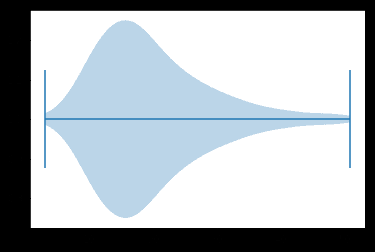
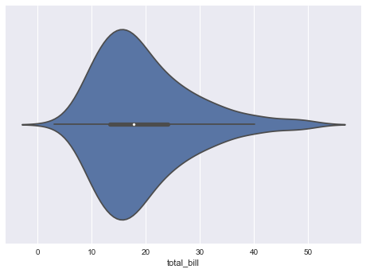
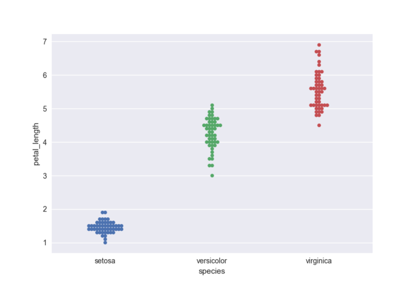
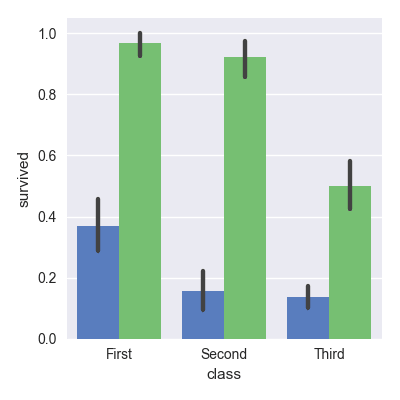
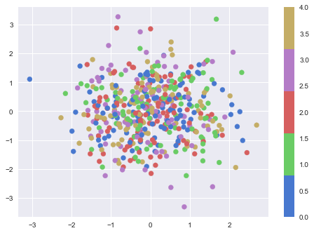
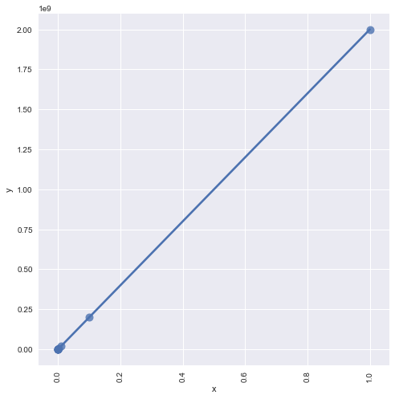

**前言**

提升你的洞察的最好方法之一是通过可视化你的数据：这样，你可以更容易地识别模式，掌握到困难的概念以及注意到关键的要素，当你使用数据科学中的Python时，你很有可能已经用了Matplotlib,一个供你创建高质量图像的2D库。另一个免费的可视化库是Seabon,他提供了一个绘制统计图形的高级接口。

这篇文章覆盖了大部分常见问题，当用户开始用Seaborn库的时候，下面有多少问题，你能正确地回答。

* 1.用Seaborn VS Matplotlib ？
* 2.如何装载数据来构建Seaborn点
* 3.如何显示Seaborn点
* 4.如何在默认matplotlib的情况下，使用Seaborn
* 5.如何调整Seaborn的上下文环境
* 6.如何调整图像样式
* 7.如何旋转标签文字
* 8.如何设置X/Y坐标
* 9.如何设置刻度
* 10.如何添加标题

**原文地址**：https://www.datacamp.com/community/tutorials/seaborn-python-tutorial#sm

如果对Matplotlib及Seaborn感兴趣的话，请参加DataCamp的课程[Introduction to Data Visualization with Python](https://link.jianshu.com/?t=https://www.datacamp.com/courses/introduction-to-data-visualization-with-python).

## Seaborn vs Matplotlib
正如你所知道的，Seaborn是比Matplotlib更高级的免费库，特别地以数据可视化为目标，但他要比这一切更进一步：他解决了用Matplotlib的2个最大问题，正如Michael Waskom所说的：Matplotlib试着让简单的事情更加简单，困难的事情变得可能，那么Seaborn就是让困难的东西更加简单。

用Matplotlib最大的困难是其默认的各种参数，而Seaborn则完全避免了这一问题。

``` python
# Import the necessary libraries
import matplotlib.pyplot as plt
import pandas as pd

# Initialize Figure and Axes object
fig, ax = plt.subplots()

# Load in data
tips =   pd.read_csv("https://raw.githubusercontent.com/mwaskom/seaborn-data/master/tips.csv")

# Create violinplot
ax.violinplot(tips["total_bill"], vert=False)

# Show the plot
plt.show()
```



``` python
# Import the necessary libraries
import matplotlib.pyplot as plt
import pandas as pd
import seaborn as sns

# Load the data
tips =       pd.read_csv("https://raw.githubusercontent.com/mwaskom/seaborn-data/master/tips.csv")

# Create violinplot
sns.violinplot(x = "total_bill", data=tips)

# Show the plot
plt.show()
```



Matplotlib的默认风格，通常不会增加颜色以及坐标轴的刻度标签以及样式。
而且Seaborn是Matplotlib的延伸和扩展，如果你知道Matplotlib，你就已经掌握了Seaborn的大部分；

## 如何加载数据构建Seaborn图像

当您使用Seaborn时，您可以使用库本身提供的内置数据集之一，也可以加载Pandas DataFrame。

### 装载内置海床数据集

要开始使用内置的Seaborn数据集，可以使用load_dataset（）函数。 要查看内置的所有数据集，请点击此处查看 https://github.com/mwaskom/seaborn-data 。 请查看以下示例来查看load_dataset（）函数的工作原理

``` python
# Import necessary libraries
import seaborn as sns
import matplotlib.pyplot as plt

# Load iris data
iris = sns.load_dataset("iris")

# Construct iris plot
sns.swarmplot(x="species", y="petal_length", data=iris)

# Show plot
plt.show()
```



### 加载您自己的DataFrame数据集

当然，数据可视化的大部分场景您将使用自己的数据，而不是Seaborn库的内置数据集。 Seaborn最适用于包含整个数据集的Pandas DataFrames和数组

DataFrames是一种在矩形网格中存储数据的方法，DataFrame的行不需要包含相同类型的值：它们可以是数字，字符，逻辑等。特别是对于Python，DataFrames集成于Pandas库中，它们被定义为具有潜在不同类型的列的二维标记数据结构。

Seaborn对DataFrames非常好的原因是，因为DataFrames的标签会自动传播到绘图或其他数据结构，正如本教程的第一个示例所示，您在Seaborn中绘制了一个小提琴。在那里，你看到x轴有一个传说total_bill，而Matplotlib图则不是这样。这已经需要很多工作了。

但这并不意味着所有的工作都完成了 - 恰恰相反。在许多情况下，您仍然需要操作您的Pandas DataFrame，以使绘图正确呈现。如果您想了解更多信息，请查看DataCamp的Python中的DataFrames Pandas教程或Pandas Foundations课程

Matplotlib仍然是Seaborn的基础，这意味着结构仍然是一样的，您需要使用plt.show（）使图像显示给您。 您可能已经从本教程上一个示例中看到过。 在任何情况下，这里是另一个例子，其中show（）函数用于显示绘图

``` python
# Import necessarily libraries
import matplotlib.pyplot as plt
import seaborn as sns

# Load data
titanic = sns.load_dataset("titanic")

# Set up a factorplot
g = sns.factorplot("class", "survived", "sex", data=titanic, kind="bar", palette="muted", legend=False)

# Show plot
plt.show()
```

## 如何显示Seaborn点
matplotlib仍然是Seaborn的基础，这意味着绘图方面两者仍然是相同的，你就需要使用plt.show()显示图像。您可能已经在本教程的前一个示例中看到了这一点。在任何情况下，下面是另一个示例, 其中show() 函数用于显示图像：

``` python
# Import necessarily libraries
import matplotlib.pyplot as plt
import seaborn as sns

# Load data
titanic = sns.load_dataset("titanic")

# Set up a factorplot
g = sns.factorplot("class", "survived", "sex", data=titanic, kind="bar", palette="muted", legend=False)

# Show plot
plt.show()
```



> 注意：在上面的代码块中, 您使用内置的 Seaborn 数据集, 并使用它创建一个 factorplot。factorplot 是一个多类型绘图，上面例子中是一个柱状图，因为你设置的参数为'柱状'，同时, 你还可以应设置颜色参数, 并将图例设置为 False

## 如何使用Seaborn用Matplotlib的默认值

也有很多相反的场景，即那些使用Seaborn并希望用Matplotlib默认设置的问题。

之前，您可以通过从Seaborn包导入apionly模块来解决这个问题。 现在已经弃用了（自2017年7月起）。 导入Seaborn时，不再应用默认样式，因此您需要显式调用set（）或set_style（），set_context（）和set_palette（）中的一个或多个以获取Seaborn或Matplotlib默认的绘图。

``` python
# Import Matplotlib
import matplotlib.pyplot as plt

# Check the available styles
plt.style.available

# Use Matplotlib defaults
plt.style.use("classic")
```

## 如何在Matplotlib中使用Seaborn的颜色作为色彩？

如何将Seaborn颜色引入Matplotlib图中的问题。 您可以使用color_palette（）来定义要使用的颜色映射和参数n_colors的颜色数。 在这种情况下，这个例子将假设有5个标签分配给在data1和data2中定义的数据点，所以这就是为什么你传递5到这个参数，你也做一个长度等于N的列表，其中5个整数变化 在可变颜色

``` python
# Import the necessary libraries
import seaborn as sns
import matplotlib.pyplot as plt
import numpy as np
from matplotlib.colors import ListedColormap

# Define a variable N
N = 500

# Construct the colormap
current_palette = sns.color_palette("muted", n_colors=5)
cmap = ListedColormap(sns.color_palette(current_palette).as_hex())

# Initialize the data
data1 = np.random.randn(N)
data2 = np.random.randn(N)
# Assume that there are 5 possible labels
colors = np.random.randint(0,5,N)

# Create a scatter plot
plt.scatter(data1, data2, c=colors, cmap=cmap)

# Add a color bar
plt.colorbar()
```



## 如何在Seaborn中旋转标签文本

要在Seaborn图中旋转标签文本，您需要处理图级别。 请注意，在下面的代码块中，您可以使用FacetGrid方法之一，即set_xticklabels来旋转文本

``` python
# Import the necessary libraries
import matplotlib.pyplot as plt
import seaborn as sns
import numpy as np
import pandas as pd

# Initialize the data
x = 10 ** np.arange(1, 10)
y = x * 2
data = pd.DataFrame(data={'x': x, 'y': y})

# Create an lmplot
grid = sns.lmplot('x', 'y', data, size=7, truncate=True, scatter_kws={"s": 100})

# Rotate the labels on x-axis
grid.set_xticklabels(rotation=90)

# Show the plot
plt.show()
```




