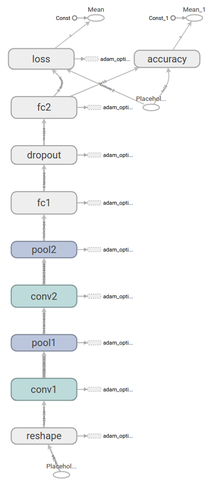

TensorFlow是一个非常强大的用来做大规模数值计算的库。其所擅长的任务之一就是实现以及训练深度神经网络。

在本教程中，我们将学到构建一个TensorFlow模型的基本步骤，并将通过这些步骤为MNIST构建一个深度卷积神经网络。

本介绍假定熟悉神经网络和 MNIST 数据集。如果你没有他们的背景, 看看[新手指南](/ml/tensorflow/)。请务必在启动前安装 TensorFlow。

## 关于本教程
本教程的第一部分解释了 [mnist_softmax.py](https://www.github.com/tensorflow/tensorflow/blob/master/tensorflow/examples/tutorials/mnist/mnist_softmax.py), 这是 Tensorflow 模型的基本实现。第二部分介绍了提高测量精度的方法。

您可以将本教程中的每个代码段复制并粘贴到 Python 环境中, 或者您可以从 [mnist_deep.py](https://www.github.com/tensorflow/tensorflow/blob/master/tensorflow/examples/tutorials/mnist/mnist_deep.py) 下载完全实现的代码。

我们将在本教程中完成的任务：
* 创建一个softmax回归函数，该函数是基于查看图像中的每个像素来识别mnist数据的模型
* 使用 Tensorflow 来训练模型, 通过让它 "看" 成千上万的例子来识别数字 (并运行我们的第一个 Tensorflow 会话
* 用我们的测试数据检查模型的准确性
* 构建、训练和测试多层卷积神经网络以提高结果

## 安装
在创建模型之前，我们会先加载MNIST数据集，然后启动一个TensorFlow的session。

### 加载MNIST数据

为了方便起见，我们已经准备了[一个脚本](https://raw.githubusercontent.com/tensorflow/tensorflow/master/tensorflow/examples/tutorials/mnist/input_data.py)来自动下载和导入MNIST数据集。它会自动创建一个 `'MNIST_data'` 的目录来存储数据。

``` python
import input_data
mnist = input_data.read_data_sets('MNIST_data', one_hot=True)
```

这里，`mnist` 是一个轻量级的类。它以Numpy数组的形式存储着训练、校验和测试数据集。同时提供了一个函数，用于在迭代中获得 `minibatch` ，后面我们将会用到。

### 运行TensorFlow的InteractiveSession

Tensorflow依赖于一个高效的C++后端来进行计算。与后端的这个连接叫做session。一般而言，使用TensorFlow程序的流程是先创建一个图，然后在session中启动它。

这里，我们使用更加方便的 `InteractiveSession` 类。通过它，你可以更加灵活地构建你的代码。它能让你在运行图的时候，插入一些[计算图](https://www.tensorflow.org/versions/master/get_started/get_started#the_computational_graph)，这些计算图是由某些操作(operations)构成的。这对于工作在交互式环境中的人们来说非常便利，比如使用IPython。如果你没有使用 `InteractiveSession`，那么你需要在启动session之前构建整个计算图，然后[启动该计算图](https://www.tensorflow.org/versions/master/get_started/get_started#the_computational_graph)。

``` python
import tensorflow as tf
sess = tf.InteractiveSession()
```

### 计算图
为了在 python 中进行高效的数值计算, 我们通常使用像 NumPy 这样的库, 它使用其他语言实现的高效代码, 例如在 python 之外执行昂贵的运算 (如矩阵乘法)。不幸的是, 在每个操作中切换回 Python 仍然会有很多开销。如果要在 gpu 或分布式方式下运行计算, 而传输数据的成本很高, 这一开销更加可怖。

TensorFlow也是在Python外部完成其主要工作，但是进行了改进以避免这种开销。其并没有采用在Python外部独立运行某个耗时操作的方式，而是先让我们描述一个交互操作图，然后完全将其运行在Python外部。这与Theano或Torch的做法类似。

因此Python代码的目的是用来构建这个可以在外部运行的计算图，以及安排计算图的哪一部分应该被运行。详情请查看[tensroflow入门](/ml/tensorflow/)中的计算图表一节。

## 构建Softmax 回归模型

在这一节中我们将建立一个拥有一个线性层的softmax回归模型。在下一节，我们会将其扩展为一个拥有多层卷积网络的softmax回归模型。

### 占位符

我们通过为输入图像和目标输出类别创建节点，来开始构建计算图。

``` python
x = tf.placeholder(tf.float32, shape=[None, 784])
y_ = tf.placeholder(tf.float32, shape=[None, 10])
```

这里的`x`和`y`并不是特定的值，相反，他们都只是一个`占位符`，可以在TensorFlow运行某一计算时根据该占位符输入具体的值。

输入图片x是一个2维的浮点数张量。这里，分配给它的`shape`为`[None, 784]`，其中`784`是一张展平的MNIST图片的维度。`None`表示其值大小不定，在这里作为第一个维度值，用以指代batch的大小，意即`x`的数量不定。输出类别值`y_`也是一个2维张量，其中每一行为一个10维的one-hot向量,用于代表对应某一MNIST图片的类别。

虽然`placeholder`的`shape`参数是可选的，但有了它，TensorFlow能够自动捕捉因数据维度不一致导致的错误。

### 变量

我们现在为模型定义权重W和偏置b。可以将它们当作额外的输入量，但是TensorFlow有一个更好的处理方式：变量。一个变量代表着TensorFlow计算图中的一个值，能够在计算过程中使用，甚至进行修改。在机器学习的应用过程中，模型参数一般用Variable来表示。

``` python
W = tf.Variable(tf.zeros([784,10]))
b = tf.Variable(tf.zeros([10]))
```

我们在调用`tf.Variable`的时候传入初始值。在这个例子里，我们把`W`和`b`都初始化为零向量。`W`是一个784x10的矩阵（因为我们有784个特征和10个输出值）。b是一个10维的向量（因为我们有10个分类）。

`变量`需要通过seesion初始化后，才能在session中使用。这一初始化步骤为，为初始值指定具体值（本例当中是全为零），并将其分配给每个`变量`,可以一次性为所有`变量`完成此操作。

``` python
sess.run(tf.global_variables_initializer())
```

### 类别预测与损失函数

现在我们可以实现我们的回归模型了。这只需要一行！我们把向量化后的图片x和权重矩阵W相乘，加上偏置b，然后计算每个分类的softmax概率值。

``` python
y = tf.matmul(x,W) + b
```

我们可以简单地指定一个损失函数。损失表明模型的预测在一个单一的例子是多么糟糕;我们试图尽量减少, 而在所有的例子培训。在这里, 我们的损失函数是熵的目标和 softmax 激活函数应用于模型的预测。在初学者教程中, 我们使用稳定的公式:

``` python
cross_entropy = tf.reduce_mean(
    tf.nn.softmax_cross_entropy_with_logits(labels=y_, logits=y))
```

请注意, `tf.nn.softmax_cross_entropy_with_logits` 内部将 softmax 应用于模型的规范化模型预测和所有类的求和, 而 `tf. reduce_mean` 的平均值超过这些总和。

## 训练模型

我们已经定义好模型和训练用的损失函数，那么用TensorFlow进行训练就很简单了。因为TensorFlow知道整个计算图，它可以使用自动微分法找到对于各个变量的损失的梯度值。TensorFlow有[大量内置的优化算法](https://www.tensorflow.org/versions/master/api_guides/python/train#optimizers) 这个例子中，我们用最速下降法让交叉熵下降，步长为0.5.

``` python
train_step = tf.train.GradientDescentOptimizer(0.5).minimize(cross_entropy)
```

这一行代码实际上是用来往计算图上添加一个新操作，其中包括计算梯度，计算每个参数的步长变化，并且计算出新的参数值。

返回的`train_step`操作对象，在运行时会使用梯度下降来更新参数。因此，整个模型的训练可以通过反复地运行`train_step`来完成。

``` python
for _ in range(1000):
  batch = mnist.train.next_batch(100)
  train_step.run(feed_dict={x: batch[0], y_: batch[1]})
```

每一步迭代，我们都会加载100个训练样本，然后执行一次`train_step`，并通过`feed_dict`将`x` 和 `y_`张量`占位符`用训练训练数据替代。

注意，在计算图中，你可以用`feed_dict`来替代任何张量，并不仅限于替换占位符。

### 评估模型

那么我们的模型性能如何呢？

首先让我们找出那些预测正确的标签。`tf.argmax` 是一个非常有用的函数，它能给出某个tensor对象在某一维上的其数据最大值所在的索引值。由于标签向量是由0,1组成，因此最大值1所在的索引位置就是类别标签，比如`tf.argmax(y,1)`返回的是模型对于任一输入x预测到的标签值，而 `tf.argmax(y_,1)` 代表正确的标签，我们可以用 `tf.equal` 来检测我们的预测是否真实标签匹配(索引位置一样表示匹配)。

``` python
correct_prediction = tf.equal(tf.argmax(y,1), tf.argmax(y_,1))
```

这里返回一个布尔数组。为了计算我们分类的准确率，我们将布尔值转换为浮点数来代表对、错，然后取平均值。例如：`[True, False, True, True]`变为`[1,0,1,1]`，计算出平均值为0.75。

``` python
accuracy = tf.reduce_mean(tf.cast(correct_prediction, tf.float32))
```

最后，我们可以计算出在测试数据上的准确率，大概是92%。

``` python
print(accuracy.eval(feed_dict={x: mnist.test.images, y_: mnist.test.labels}))
```

## 构建一个多层卷积网络

在MNIST上只有92%正确率，实在太糟糕。在这个小节里，我们用一个稍微复杂的模型：卷积神经网络来改善效果。这会达到大概99.2%的准确率。虽然不是最高，但是还是比较让人满意。

这里是一个用张量板创建的关于我们将建立的模型的图表:



### 权重初始化

为了创建这个模型，我们需要创建大量的权重和偏置项。这个模型中的权重在初始化时应该加入少量的噪声来打破对称性以及避免0梯度。由于我们使用的是ReLU神经元，因此比较好的做法是用一个较小的正数来初始化偏置项，以避免神经元节点输出恒为0的问题（dead neurons）。为了不在建立模型的时候反复做初始化操作，我们定义两个函数用于初始化。

``` python
def weight_variable(shape):
  initial = tf.truncated_normal(shape, stddev=0.1)
  return tf.Variable(initial)

def bias_variable(shape):
  initial = tf.constant(0.1, shape=shape)
  return tf.Variable(initial)
```

### 卷积和池化

TensorFlow在卷积和池化上有很强的灵活性。我们怎么处理边界？步长应该设多大？在这个实例里，我们会一直使用vanilla版本。我们的卷积使用1步长（stride size），0边距（padding size）的模板，保证输出和输入是同一个大小。我们的池化用简单传统的2x2大小的模板做max pooling。为了代码更简洁，我们把这部分抽象成一个函数。

``` python
def conv2d(x, W):
  return tf.nn.conv2d(x, W, strides=[1, 1, 1, 1], padding='SAME')

def max_pool_2x2(x):
  return tf.nn.max_pool(x, ksize=[1, 2, 2, 1],
                        strides=[1, 2, 2, 1], padding='SAME')
```

### 第一层卷积

现在我们可以开始实现第一层了。它由一个卷积接一个max pooling完成。卷积在每个5x5的patch中算出32个特征。卷积的权重张量形状是`[5, 5, 1, 32]`，前两个维度是patch的大小，接着是输入的通道数目，最后是输出的通道数目。 而对于每一个输出通道都有一个对应的偏置量。

``` python
W_conv1 = weight_variable([5, 5, 1, 32])
b_conv1 = bias_variable([32])
```

为了用这一层，我们把x变成一个4d向量，其第2、第3维对应图片的宽、高，最后一维代表图片的颜色通道数(因为是灰度图所以这里的通道数为1，如果是rgb彩色图，则为3)。

``` python
x_image = tf.reshape(x, [-1, 28, 28, 1])
```

我们把`x_image`和权值向量进行卷积，加上偏置项，然后应用ReLU激活函数，最后进行max pool。`max_pool_2x2` 方法将图像大小缩小为14x14。

``` python
h_conv1 = tf.nn.relu(conv2d(x_image, W_conv1) + b_conv1)
h_pool1 = max_pool_2x2(h_conv1)
```

### 第二层卷积

为了构建一个更深的网络，我们会把几个类似的层堆叠起来。第二层中，每个5x5的patch会得到64个特征。

``` python
W_conv2 = weight_variable([5, 5, 32, 64])
b_conv2 = bias_variable([64])

h_conv2 = tf.nn.relu(conv2d(h_pool1, W_conv2) + b_conv2)
h_pool2 = max_pool_2x2(h_conv2)
```

### 密集连接层

现在，图片尺寸减小到7x7，我们加入一个有1024个神经元的全连接层，用于处理整个图片。我们把池化层输出的张量reshape成一些向量，乘上权重矩阵，加上偏置，然后对其使用ReLU。

``` python
W_fc1 = weight_variable([7 * 7 * 64, 1024])
b_fc1 = bias_variable([1024])

h_pool2_flat = tf.reshape(h_pool2, [-1, 7*7*64])
h_fc1 = tf.nn.relu(tf.matmul(h_pool2_flat, W_fc1) + b_fc1)
```

### Dropout

为了减少过拟合，我们在输出层之前加入dropout。我们用一个placeholder来代表一个神经元的输出在dropout中保持不变的概率。这样我们可以在训练过程中启用dropout，在测试过程中关闭dropout。 TensorFlow的tf.nn.dropout操作除了可以屏蔽神经元的输出外，还会自动处理神经元输出值的scale。所以用dropout的时候可以不用考虑scale。

``` python
keep_prob = tf.placeholder(tf.float32)
h_fc1_drop = tf.nn.dropout(h_fc1, keep_prob)
```

### 输出层

最后，我们添加一个softmax层，就像前面的单层softmax regression一样。

``` python
W_fc2 = weight_variable([1024, 10])
b_fc2 = bias_variable([10])

y_conv=tf.nn.softmax(tf.matmul(h_fc1_drop, W_fc2) + b_fc2)
```

### 训练和评估模型

这个模型的效果如何呢？为了进行训练和评估，我们使用与之前简单的单层SoftMax神经网络模型几乎相同的一套代码。

不同的是：
* 我们将取代最陡峭的梯度下降优化器与更复杂的 ADAM优化器。
* 在feed_dict中加入额外的参数keep_prob来控制dropout比例
* 每100次迭代输出一次日志。

我们也将使用 `tf.Session` 而不是 `tf.InteractiveSession`, 这更好地区分了创建图形 (模型规范) 的过程和计算图 (模型拟合) 的过程。它通常会使代码更简洁。`tf.Session` 在 [with block](https://docs.python.org/3/whatsnew/2.6.html#pep-343-the-with-statement) 中创建, 以便在块退出后自动销毁。

随时运行此代码。请注意, 它会进行2万次训练迭代, 并且可能需要一段时间 (可能长达半小时), 这取决于您的处理器。

``` python
cross_entropy = tf.reduce_mean(
    tf.nn.softmax_cross_entropy_with_logits(labels=y_, logits=y_conv))
train_step = tf.train.AdamOptimizer(1e-4).minimize(cross_entropy)
correct_prediction = tf.equal(tf.argmax(y_conv, 1), tf.argmax(y_, 1))
accuracy = tf.reduce_mean(tf.cast(correct_prediction, tf.float32))

with tf.Session() as sess:
  sess.run(tf.global_variables_initializer())
  for i in range(20000):
    batch = mnist.train.next_batch(50)
    if i % 100 == 0:
      train_accuracy = accuracy.eval(feed_dict={
          x: batch[0], y_: batch[1], keep_prob: 1.0})
      print('step %d, training accuracy %g' % (i, train_accuracy))
    train_step.run(feed_dict={x: batch[0], y_: batch[1], keep_prob: 0.5})

  print('test accuracy %g' % accuracy.eval(feed_dict={
      x: mnist.test.images, y_: mnist.test.labels, keep_prob: 1.0}))
```

以上代码，在最终测试集上的准确率大概是99.2%。

目前为止，我们已经学会了用TensorFlow快捷地搭建、训练和评估一个复杂一点儿的深度学习模型。
