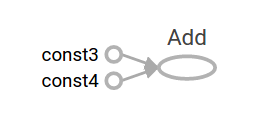
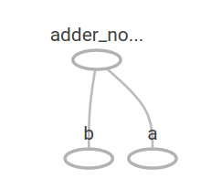
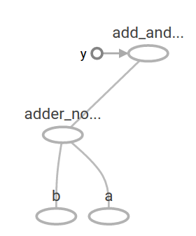
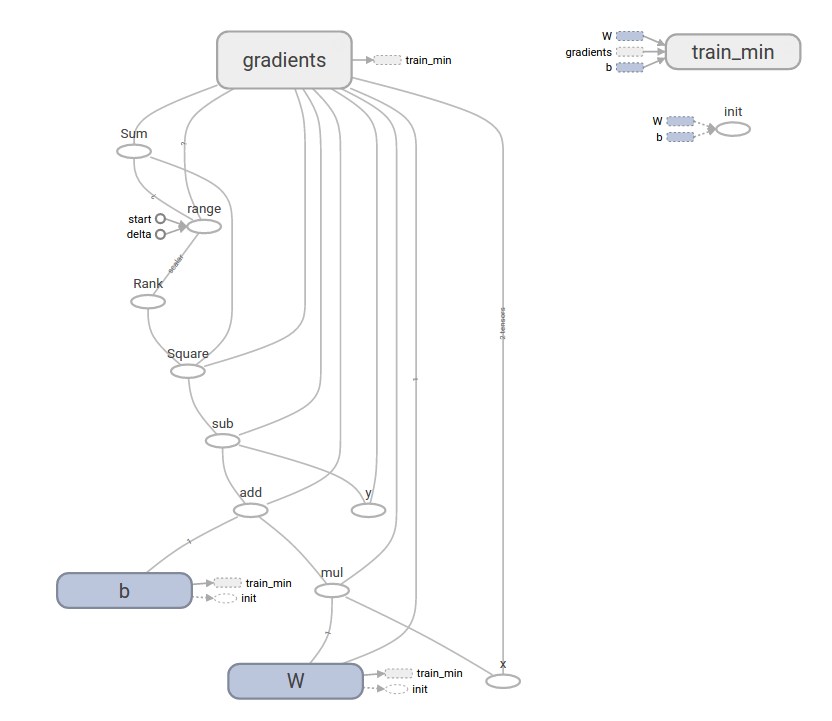

## 介绍

本指南让您开始在TensorFlow中编程。在使用本指南之前， 请先 [安装TensorFlow](https://www.tensorflow.org/versions/master/install/index)。为了从本指南中获得最大的帮助，您应该先了解以下内容：
* 如何用Python编程。
* 至少有一点关于数组。
* 最理想的情况下是对机器学习有些许认知。但是，如果您对机器学习知之甚少，那么这仍然是您应该阅读的第一本指南。

TensorFlow 提供了多个 api。最低级别的 API--`TensorFlow Core` 为您提供完整的程序控制。我们建议将 `TensorFlow Core` 作为机器学习研究人员和其他需要良好水平的人的控制模型。更高层次的 api 是建立在 `TensorFlow Core` 之上的。这些更高层次的 api 通常比 `TensorFlow Core` 更容易学习和使用。此外, 较高级别的 api 重复任务更容易, 并且在不同用户之间更加一致。像高级 API比如 `tf.estimator` 可以帮助您管理数据集、估计、培训和推断。

本指南从 `TensorFlow Core` 的教程开始。稍后, 我们将演示如何在 `tf.estimator` 中实现相同的模型。了解 `TensorFlow Core` 原理有很大作用, 当您使用更紧凑的高级 API 时, 更清楚内部事物是如何工作的。

### 基本概念
* 使用图 (graph) 来表示计算任务.
* 在被称之为 会话 (Session) 的上下文 (context) 中执行图.
* 使用 tensor 表示数据.
* 通过 变量 (Variable) 维护状态.
* 使用 feed 和 fetch 可以为任意的操作(arbitrary operation) 赋值或者从其中获取数据.

### Tensors(张量)

TensorFlow 中数据的中心单位是 tensor。tensor 由一组形成于任意维数数组的原始值组成。tensor 的 rank(秩) 是它的维数。下面是 tensor 的一些示例:

``` python
3 # 规模最小的张量是0阶张量，即标量，也就是一个数。
[1., 2., 3.] # 把一些数有序的排列起来，就形成了1阶张量，也就是一个向量
[[1., 2., 3.], [4., 5., 6.]] # 把一组向量有序的排列起来，就形成了2阶张量，也就是一个矩阵,
[[[1., 2., 3.]], [[7., 8., 9.]]] # 把矩阵摞起来，就是3阶张量，我们可以称为一个立方体
```

张量的阶数有时候也称为维度，或者轴，轴这个词翻译自英文axis。譬如一个矩阵[[1,2],[3,4]]，是一个2阶张量，有两个维度或轴，沿着第0个轴（为了与python的计数方式一致，本文档维度和轴从0算起）你看到的是[1,2]，[3,4]两个向量，沿着第1个轴你看到的是[1,3]，[2,4]两个向量。

## TensorFlow 核心教程

### 导入 TensorFlow 模块

``` python
import tensorflow as tf
```

 这使 Python 可以访问 TensorFlow 的所有类、方法和符号。大多数文档假定您已经完成了此操作。

### 计算图

你可能会想到TensorFlow核心程序由两个独立的部分组成：

* 构建计算图
* 运行计算图

一个计算图是将一系列的 TensorFlow 操作(`Operation`)排列成一个节点图。让我们建立一个简单的计算图。每个节点以零或更多张量作为输入, 并生成一个张量作为输出。有一种类型的节点是常量。像所有的 TensorFlow 常量一样, 它不需要输入, 并且输出一个它在内部存储的值。我们可以创建两个浮点张量 node1 和 node2 如下:

``` python
node1 = tf.constant(3.0, dtype=tf.float32)
node2 = tf.constant(4.0) # also tf.float32 implicitly
print(node1, node2)
```
当它运行时，会输出
``` python
Tensor("Const:0", shape=(), dtype=float32) Tensor("Const_1:0", shape=(), dtype=float32)
```

请注意, 打印节点不会像您预期的那样输出值3.0 和4.0，相反, 它们是在计算时将分别产生3.0 和4.0 的节点，要实际评估节点, 我们必须在一个会话(`session`)中运行计算图，会话封装了 TensorFlow 运行时的控制和状态。

下面的代码创建一个 `session` 对象, 然后调用其 run 方法以运行足够的计算图来计算 node1 和 node2。通过在会话(`session`)中运行计算图, 如下所示：

``` python
sess = tf.Session()
print(sess.run([node1, node2]))
```
当它运行时，会输出
``` python
[3.0, 4.0]
```

我们可以通过将张量节点与操作结合起来构建更复杂的计算（操作也是节点）。例如，我们可以添加两个常量节点并生成一个新的图，如下所示：

``` python
from __future__ import print_function
node3 = tf.add(node1, node2)
print("node3:", node3)
print("sess.run(node3):", sess.run(node3))
```
当它运行时，会输出
``` python
node3: Tensor("Add:0", shape=(), dtype=float32)
sess.run(node3): 7.0
```

TensorFlow 提供了一种称为 `TensorBoard` 的实用程序, 可以显示计算图的图片。下面是一个截图, 展示了 `TensorBoard` 如何直观地显示图:



事实上，这张图并不特别有趣，因为它总是产生一个固定的结果。一个图可以接受外部输入的参数，称为占位符(`placeholder`)。占位符是稍后提供值的保证。

``` python
a = tf.placeholder(tf.float32)
b = tf.placeholder(tf.float32)
adder_node = a + b
```

上面三行有点像函数或 lambda, 我们在其中定义了两个输入参数 (a 和 b), 然后对它们进行操作。我们可以用多个输入来计算这个图, 它使用 feed_dict 参数到 run 方法来给占位符提供具体值:

``` python
print(sess.run(adder_node, {a: 3, b: 4.5}))
print(sess.run(adder_node, {a: [1, 3], b: [2, 4]}))
```
当它运行时，会输出
``` python
7.5
[3. 7.]
```

在 TensorBoard 中, 图形如下所示:



我们可以通过添加另一个操作使计算图更加复杂。例如,

``` python
add_and_triple = adder_node * 3.
print(sess.run(add_and_triple, {a: 3, b: 4.5}))
```
当它运行时，会输出
``` python
22.5
```

计算图在 TensorBoard 中如下所示:



在机器学习中, 我们通常需要一个可以接受任意输入的模型, 比如上面的一个。为了使模型训练, 我们需要能够修改图形, 以获得相同的输入新的输出。变量(`Variables `)允许我们向图中添加训练参数。它们是用类型和初始值构造的:

``` python
W = tf.Variable([.3], dtype=tf.float32)
b = tf.Variable([-.3], dtype=tf.float32)
x = tf.placeholder(tf.float32)
linear_model = W*x + b
```

常量在调用 `tf.constant` 时初始化, 它们的值永远不会改变。相反, 当调用 `tf.Variable` 时, 变量不会初始化。变量.若要初始化 TensorFlow 程序中的所有变量, 必须显式调用特殊操作, 如下所示:

``` python
init = tf.global_variables_initializer()
sess.run(init)
```

重要的是 `init` 是一个 TensorFlow 子图, 它是初始化所有的全局变量的句柄。在我们调用  `sess.run` 之前, 变量是未初始化的。

由于 x 是占位符, 因此我们可以同时对 x 的多个值进行 linear_model 计算, 如下所示:

``` python
print(sess.run(linear_model, {x: [1, 2, 3, 4]}))
```
当它运行时，会输出
``` python
[0.         0.3        0.6        0.90000004]
```

我们已经建立了一个模型, 但我们还不知道它有多好。为了评估培训数据的模型, 我们需要一个 y 占位符来提供所需的值, 我们需要写一个损失函数。

损失函数(`loss function`)用于测量当前模型与所提供数据之间的距离。我们将使用一个标准的线性回归模型, 总结了目前模型和提供数据之间的方差之和。`linear_model y` 创建一个向量, 其中每个元素都是误差相应的delta。我们调用 `tf.square` 来给误差做平方计算。然后，然后,我们使用 `tf.reduce_sum` 来创建一个标量用来计算所有的平方差之和来将所有error实例抽象出来:

``` python
y = tf.placeholder(tf.float32)
squared_deltas = tf.square(linear_model - y)
loss = tf.reduce_sum(squared_deltas)
print(sess.run(loss, {x: [1, 2, 3, 4], y: [0, -1, -2, -3]}))
```
当它运行时，会输出
``` python
23.66
```

我们可以通过将 W 和 b 的值重新指派为-1 和1的完美值来手动改进此项。变量初始化的值为 `tf.Variable` 提供 。可以使用 `tf.assign` 进行改变。例如，w＝1和B＝1是我们模型的最佳参数。我们可以相应地改变w和b：

``` python
fixW = tf.assign(W, [-1.])
fixb = tf.assign(b, [1.])
sess.run([fixW, fixb])
print(sess.run(loss, {x: [1, 2, 3, 4], y: [0, -1, -2, -3]}))
```
当它运行时，会输出
``` python
[array([-1.], dtype=float32), array([1.], dtype=float32)]
0.0
```

我们猜测 W 和 b 的 "完美" 值, 但机器学习的全部意义是自动找到正确的模型参数。在下一节中, 我们将演示如何完成此操作。

## tf.train API
关于机器学习的完整讨论超出了本教程的范围。然而, TensorFlow 提供优化器(`optimizers`), 慢慢地改变每个变量, 以尽量减少损失函数(`loss function`)。最简单的优化器是梯度下降(`gradient descent`)。它根据该变量的损失函数的大小来修正每个变量。一般而言, 手工计算 ` symbolic derivatives` 是单调乏味且容易出错的。因此, TensorFlow 可以自动产生 `derivatives` , 只给出一个描述的模型使用函数 `tf.gradients` 。为了简单起见, 优化器(`optimizers`) 通常为您执行此操作。例如,

``` python
optimizer = tf.train.GradientDescentOptimizer(0.01)
train = optimizer.minimize(loss)
```
``` python
sess.run(init) # reset variables to incorrect defaults.
for i in range(1000):
  sess.run(train, {x: [1, 2, 3, 4], y: [0, -1, -2, -3]})

print(sess.run([W, b]))
```
当它运行时，会输出
``` python
[array([-0.9999969], dtype=float32), array([0.9999908], dtype=float32)]
```

现在我们已经完成了实际上的机器学习!虽然这个简单的线性回归模型不需要太多的 `TensorFlow core` 代码, 但使用更复杂的模型和方法将数据导入到模型中, 这就必须有更多的代码。因此, TensorFlow 为常见的模式、结构和功能(`patterns,structures,and functionality`)提供了更高级别的抽象(`abstractions`)。在下一节中, 我们将学习如何使用这些抽象。

### 完成代码

已完成的训练线性回归模型如下所示:

``` python
import tensorflow as tf

# Model parameters
W = tf.Variable([.3], dtype=tf.float32)
b = tf.Variable([-.3], dtype=tf.float32)
# Model input and output
x = tf.placeholder(tf.float32)
linear_model = W*x + b
y = tf.placeholder(tf.float32)

# loss
loss = tf.reduce_sum(tf.square(linear_model - y)) # sum of the squares
# optimizer
optimizer = tf.train.GradientDescentOptimizer(0.01)
train = optimizer.minimize(loss)

# training data
x_train = [1, 2, 3, 4]
y_train = [0, -1, -2, -3]
# training loop
init = tf.global_variables_initializer()
sess = tf.Session()
sess.run(init) # initialize variables with incorrect defaults.
for i in range(1000):
  sess.run(train, {x: x_train, y: y_train})

# evaluate training accuracy
curr_W, curr_b, curr_loss = sess.run([W, b, loss], {x: x_train, y: y_train})
print("W: %s b: %s loss: %s"%(curr_W, curr_b, curr_loss))
```
当它运行时，会输出
``` python
W: [-0.9999969] b: [0.9999908] loss: 5.6999738e-11
```

请注意, 损失是一个非常小的数字 (非常接近零)。如果您运行此程序, 您的损失可能与前面提到的损失完全相同, 因为模型是用伪随机值初始化的。

这个更复杂的程序仍然可以在 TensorBoard 中可视化:



## tf.estimator

`tf.estimator` 是一个高级TensorFlow库,用于简化机器学习的机制,其内容包括:

* 训练循环
* 赋值循环
* 管理数据集

`tf.estimator` 定义了许多常见的模型。

### 基本用法

请注意使用 `tf.estimator` 使得线性回归变得多么简单:

```python
# NumPy is often used to load, manipulate and preprocess data.
import numpy as np
import tensorflow as tf

# Declare list of features. We only have one numeric feature. There are many
# other types of columns that are more complicated and useful.
feature_columns = [tf.feature_column.numeric_column("x", shape=[1])]

# An estimator is the front end to invoke training (fitting) and evaluation
# (inference). There are many predefined types like linear regression,
# linear classification, and many neural network classifiers and regressors.
# The following code provides an estimator that does linear regression.
estimator = tf.estimator.LinearRegressor(feature_columns=feature_columns)

# TensorFlow provides many helper methods to read and set up data sets.
# Here we use two data sets: one for training and one for evaluation
# We have to tell the function how many batches
# of data (num_epochs) we want and how big each batch should be.
x_train = np.array([1., 2., 3., 4.])
y_train = np.array([0., -1., -2., -3.])
x_eval = np.array([2., 5., 8., 1.])
y_eval = np.array([-1.01, -4.1, -7, 0.])
input_fn = tf.estimator.inputs.numpy_input_fn(
    {"x": x_train}, y_train, batch_size=4, num_epochs=None, shuffle=True)
train_input_fn = tf.estimator.inputs.numpy_input_fn(
    {"x": x_train}, y_train, batch_size=4, num_epochs=1000, shuffle=False)
eval_input_fn = tf.estimator.inputs.numpy_input_fn(
    {"x": x_eval}, y_eval, batch_size=4, num_epochs=1000, shuffle=False)

# We can invoke 1000 training steps by invoking the method and passing the
# training data set.
estimator.train(input_fn=input_fn, steps=1000)

# Here we evaluate how well our model did.
train_metrics = estimator.evaluate(input_fn=train_input_fn)
eval_metrics = estimator.evaluate(input_fn=eval_input_fn)
print("train metrics: %r"% train_metrics)
print("eval metrics: %r"% eval_metrics)
```

当它运行时，可能会输出
``` python
train metrics: {'average_loss': 1.0863615e-08, 'loss': 4.345446e-08, 'global_step': 1000}
eval metrics: {'average_loss': 0.002535033, 'loss': 0.010140132, 'global_step': 1000}
```
请注意, 我们的 eval 数据有更高的损失, 但它仍然接近于零。这意味着我们正在正确学习。

### 自定义模型

`tf.estimator` 不会将你禁锢在它预设的模型中。假设我们想要创建一个自定义模型。我们仍然可以通过 `tf.estimator` 保持高度抽象的数据集,喂养,训练等。为了说明,我们将展示如何用低级TensorFlow API实现自己的等效线性回归模型。

要使用 `tf.estimator` 定义一个自定义模型。我们需要使用 `tf.estimator.Estimator`。`tf.estimator.LinearRegressor` 实际上是 `tf.estimator.Estimator` 的一个子类。我们只是给 `Estimator` 提供一个函数 `model_fn` 来告诉 `tf.estimator` 怎样定义预测,训练步骤,和损失，而不是生成子类 `Estimator`。代码如下所示:

``` python
import numpy as np
import tensorflow as tf

# Declare list of features, we only have one real-valued feature
def model_fn(features, labels, mode):
  # Build a linear model and predict values
  W = tf.get_variable("W", [1], dtype=tf.float64)
  b = tf.get_variable("b", [1], dtype=tf.float64)
  y = W*features['x'] + b
  # Loss sub-graph
  loss = tf.reduce_sum(tf.square(y - labels))
  # Training sub-graph
  global_step = tf.train.get_global_step()
  optimizer = tf.train.GradientDescentOptimizer(0.01)
  train = tf.group(optimizer.minimize(loss),
                   tf.assign_add(global_step, 1))
  # EstimatorSpec connects subgraphs we built to the
  # appropriate functionality.
  return tf.estimator.EstimatorSpec(
      mode=mode,
      predictions=y,
      loss=loss,
      train_op=train)

estimator = tf.estimator.Estimator(model_fn=model_fn)
# define our data sets
x_train = np.array([1., 2., 3., 4.])
y_train = np.array([0., -1., -2., -3.])
x_eval = np.array([2., 5., 8., 1.])
y_eval = np.array([-1.01, -4.1, -7., 0.])
input_fn = tf.estimator.inputs.numpy_input_fn(
    {"x": x_train}, y_train, batch_size=4, num_epochs=None, shuffle=True)
train_input_fn = tf.estimator.inputs.numpy_input_fn(
    {"x": x_train}, y_train, batch_size=4, num_epochs=1000, shuffle=False)
eval_input_fn = tf.estimator.inputs.numpy_input_fn(
    {"x": x_eval}, y_eval, batch_size=4, num_epochs=1, shuffle=False)

# train
estimator.train(input_fn=input_fn, steps=1000)
# Here we evaluate how well our model did.
train_metrics = estimator.evaluate(input_fn=train_input_fn)
eval_metrics = estimator.evaluate(input_fn=eval_input_fn)
print("train metrics: %r"% train_metrics)
print("eval metrics: %r"% eval_metrics)
```

当它运行时，会输出
``` python
train metrics: {'loss': 1.08032486e-10, 'global_step': 1000}
eval metrics: {'loss': 0.010101897, 'global_step': 1000}
```

注意，自定义model()函数的内容和低级API的手动循环训练模型十分相似。

## 下一步
现在您有了TensorFlow的基础知识。我们有几个教程,您可以看看了解更多信息。如果您是初学者的话，请看[MNIST机器学习入门](/ml/tensorflow/mnist.html), 否则看[深入探索MNIST](/ml/tensorflow/deep-mnist.html).