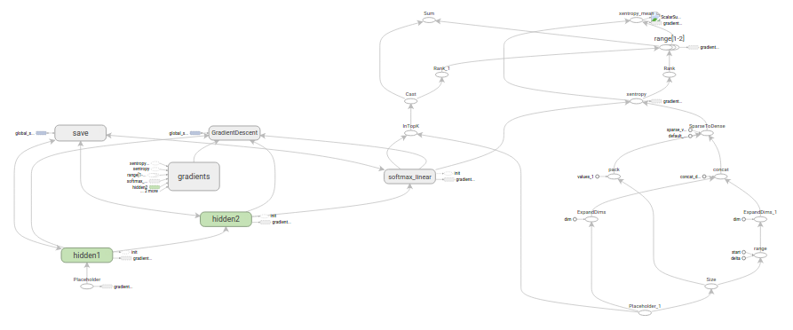

代码: [tensorflow/examples/tutorials/mnist/](Code: tensorflow/examples/tutorials/mnist/)

本篇教程的目的，是向大家展示如何利用TensorFlow使用（经典）MNIST数据集训练并评估一个用于识别手写数字的简易前馈神经网络（feed-forward neural network）。我们的目标读者，是有兴趣使用TensorFlow的资深机器学习人士。

因此，撰写该系列教程并不是为了教大家机器学习领域的基础知识。

在学习本教程之前，请确保您已按照安装TensorFlow教程中的要求，完成了安装。

## 教程使用的文件
本教程引用如下文件：

文件 | 目的
--- | ---
[mnist.py](https://www.github.com/tensorflow/tensorflow/blob/master/tensorflow/examples/tutorials/mnist/mnist.py) | 构建一个完全连接（fully connected）的MINST模型所需的代码。
[fully_connected_feed.py](https://www.github.com/tensorflow/tensorflow/blob/master/tensorflow/examples/tutorials/mnist/fully_connected_feed.py) | 利用下载的数据集训练构建好的MNIST模型的主要代码，以数据反馈字典（feed dictionary）的形式作为输入模型。

只需要直接运行`fully_connected_feed.py`文件，就可以开始训练：

``` bash
python fully_connected_feed.py
```

## 准备数据

MNIST是机器学习领域的一个经典问题，指的是让机器查看一系列大小为28x28像素的手写数字灰度图像，并判断这些图像代表0-9中的哪一个数字。

### 下载

在`run_training()`方法的一开始，`input_data.read_data_sets()`函数会确保你的本地训练文件夹中，已经下载了正确的数据，然后将这些数据解压并返回一个含有`DataSet`实例的字典。

``` python
data_sets = input_data.read_data_sets(FLAGS.train_dir, FLAGS.fake_data)
```
注意：`fake_data`标记是用于单元测试的，读者可以不必理会。

数据集 | 目的
--- | ---
`data_sets.train` | 55000个图像和标签（labels），作为主要训练集。
`data_sets.validation` | 5000个图像和标签，用于迭代验证训练准确度。
`data_sets.test` | 10000个图像和标签，用于最终测试训练准确度（trained accuracy）。

### 输入与占位符（Inputs and Placeholders）

`placeholder_inputs()`函数将生成两个`tf.placeholder`操作，定义传入图表中的shape参数，shape参数中包括`batch_size`值，后续还会将实际的训练用例传入图表。

``` python
images_placeholder = tf.placeholder(tf.float32, shape=(batch_size, mnist.IMAGE_PIXELS))
labels_placeholder = tf.placeholder(tf.int32, shape=(batch_size))
```

在训练循环（training loop）的后续步骤中，传入的整个图像和标签数据集会被切片，以符合每一个操作所设置的`batch_size`值，占位符操作将会填补以符合这个`batch_size`值。然后使用`feed_dict`参数，将数据传入`sess.run()`函数。

## 构建图表 （Build the Graph）

在为数据创建占位符之后，就可以运行`mnist.py`文件，经过三阶段的模式函数操作：`inference()`， `loss()`，和`training()`。图表就构建完成了。

1. inference() —— 尽可能地构建好图表，满足促使神经网络向前反馈并做出预测的要求。
2. loss() —— 往inference图表中添加生成损失（loss）所需要的操作（ops）。
3. training() —— 往损失图表中添加计算并应用梯度（gradients）所需的操作。



### 推理（Inference）

inference()函数会尽可能地构建图表，做到返回包含了预测结果（output prediction）的Tensor。

它接受图像占位符为输入，在此基础上借助`ReLu`(Rectified Linear Units)激活函数，构建一对完全连接层（layers），以及一个有着十个节点（node）、指明了输出logits模型的线性层。

每一层都创建于一个唯一的`tf.name_scope`之下，创建于该作用域之下的所有元素都将带有其前缀。